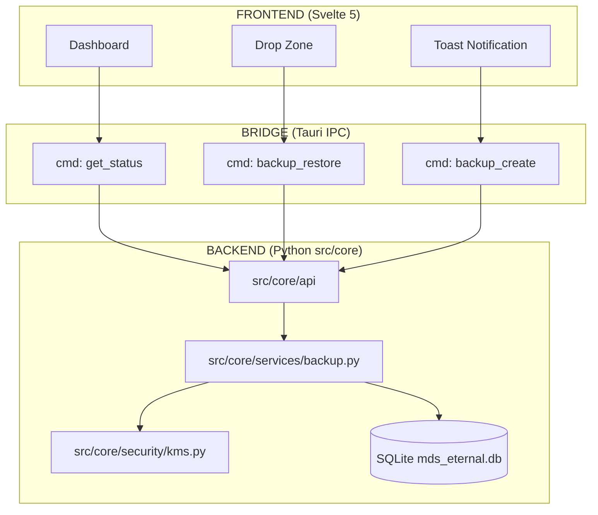

# ARCHITECTURAL GRAPH: The Bridge Pattern

**Date:** 2025-11-29  
**Status:** LIVE

```mermaid
graph TD
    subgraph "FRONTEND (Svelte 5)"
        UI_Dash[Dashboard]
        UI_Toast[Toast Notification]
        UI_Drop[Drop Zone]
    end

    subgraph "BRIDGE (Tauri IPC)"
        CMD_Backup[cmd: backup_create]
        CMD_Restore[cmd: backup_restore]
        CMD_Status[cmd: get_status]
    end

    subgraph "BACKEND (Python src/core)"
        API[src/core/api]
        SVC_Backup[src/core/services/backup.py]
        SEC_KMS[src/core/security/kms.py]
        DB[(SQLite mds_eternal.db)]
    end

    UI_Dash --> CMD_Status
    UI_Drop --> CMD_Restore
    UI_Toast --> CMD_Backup

    CMD_Status --> API
    CMD_Restore --> API
    CMD_Backup --> API

    API --> SVC_Backup
    SVC_Backup --> SEC_KMS
    SVC_Backup --> DB
```
