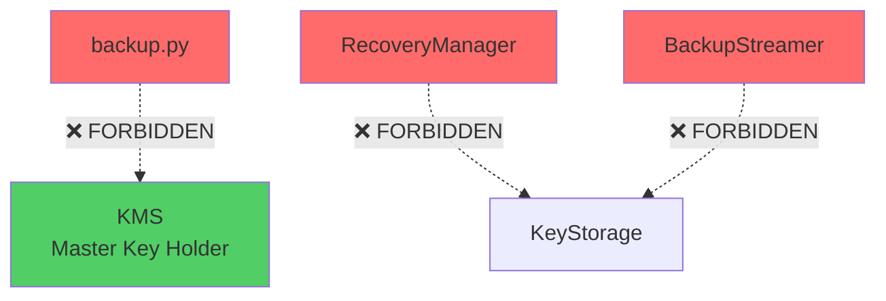
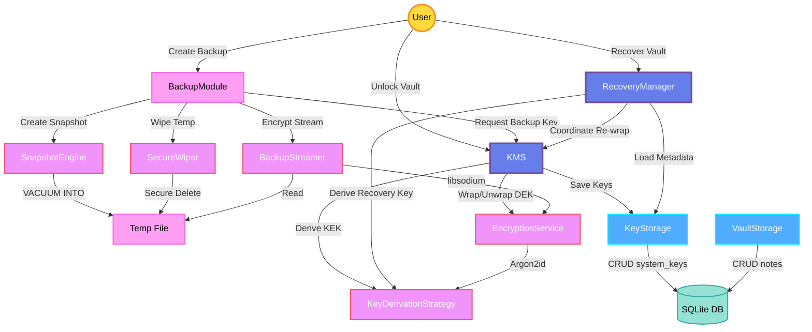

# ARCHITECTURAL GRAPH: Core Component Relationships

**Document ID:** ARCH_CORE_GRAPH  
**Purpose:** Define the "Nervous System" - Strict component relationships and separation of concerns  
**Status:** CANONICAL  
**Date:** 2025-11-27  
**Ref:** MDS v3.14, ETERNAL_RULES.md (Law #5), SPEC_TASK_5_2_BACKUP

---

## 1. OVERVIEW

This document defines the **architectural constraints** for the Convert Vault's core security components. It establishes:
- **Allowed Dependencies** (The Graph Edges)
- **Forbidden Paths** (Anti-Corruption Layer)
- **Component Responsibilities** (Single Responsibility Principle)

### 1.1 Core Principle: The Orchestrator Pattern

```
THE LAW: Orchestrators manage lifecycle and coordinate workers.
         Workers perform a single, focused task.
         Persistence handles CRUD only.
```

---

## 2. THE ARCHITECTURAL GRAPH

### 2.1 Component Hierarchy (Mermaid)

```mermaid
graph TB
        KMS[KMS<br/>Key Management System]
        RecoveryMgr[RecoveryManager<br/>Recovery Orchestrator]
    end

    subgraph "FUNCTIONAL MODULES (Stateless)"
        BackupMod[backup.py<br/>Backup/Restore Functions]
    end

    subgraph "WORKERS (The Hands)"
        EncSvc[EncryptionService<br/>Crypto Operations]
        BackupStream[BackupStreamer<br/>Stream Encryption]
        SnapshotEng[SnapshotEngine<br/>VACUUM INTO Handler]
        KeyDerive[KeyDerivationStrategy<br/>Argon2id Wrapper]
        Wiper[SecureWiper<br/>Anti-Forensics]
    end

    subgraph "PERSISTENCE (The Memory)"
        KeyStore[KeyStorage<br/>system_keys CRUD]
        VaultStore[VaultStorage<br/>notes CRUD]
        EventStore[EventStore<br/>domain_events CRUD]
    end
    
    subgraph "EXTERNAL"
        UserInt[UserInteraction<br/>Prompts/Auth]
        TempFile[Temp File<br/>Ephemeral Storage]
    end

    %% Allowed Edges (Dependencies)
    KMS --> EncSvc
    KMS --> KeyStore
    KMS --> KeyDerive
    
    BackupMod --> KMS
    BackupMod --> SnapshotEng
    BackupMod --> BackupStream
    BackupMod --> Wiper
    BackupMod --> UserInt
    
    RecoveryMgr --> KMS
    RecoveryMgr --> KeyDerive
    RecoveryMgr --> KeyStore
    
    EncSvc --> KeyDerive
    BackupStream --> EncSvc
    
    SnapshotEng --> VaultStore
    SnapshotEng --> EventStore
    SnapshotEng -.->|Produces| TempFile
    
    Wiper -.->|Destroys| TempFile

    %% Styling
    classDef orchestrator fill:#667eea,stroke:#764ba2,stroke-width:3px,color:#fff
    classDef functional fill:#ff9ff3,stroke:#f368e0,stroke-width:2px,color:#000
    classDef worker fill:#f093fb,stroke:#f5576c,stroke-width:2px,color:#fff
    classDef persistence fill:#4facfe,stroke:#00f2fe,stroke-width:2px,color:#fff
    classDef external fill:#95e1d3,stroke:#38ada9,stroke-width:2px,color:#000
    
    class KMS,RecoveryMgr orchestrator
    class BackupMod functional
    class EncSvc,BackupStream,SnapshotEng,KeyDerive,Wiper worker
    class KeyStore,VaultStore,EventStore persistence
    class UserInt,TempFile external
```

### 2.2 Forbidden Paths (The Anti-Corruption Layer)



**Forbidden Rules:**
1. **Backup Module MUST NOT access the Master Key (DEK) directly.**  
   *Why?* It must request a derived `Backup_Key` from KMS.
   
2. **RecoveryManager MUST NOT bypass KMS for key unwrapping.**  
   *Why?* Only KMS holds the in-memory DEK lifecycle.
   
3. **BackupStreamer MUST NOT read from `system_keys` table.**  
   *Why?* It operates on ephemeral keys provided by orchestrators.

---

## 3. COMPONENT SPECIFICATIONS

### 3.1 ORCHESTRATORS (The Brain)

#### 3.1.1 KMS (Key Management System)
**File:** `src/core/security/kms.py`

**Responsibilities:**
- Vault initialization (Dual-Wrapping with Passkey + Recovery Key)
- Vault unlock (KEK derivation → DEK unwrapping)
- In-memory DEK lifecycle management
- Key derivation delegation to `KeyDerivationStrategy`

**Allowed Dependencies:**
- `KeyStorage` (save/load wrapped keys)
- `EncryptionService` (wrap/unwrap DEK)
- `KeyDerivationStrategy` (derive KEKs)

**Forbidden Dependencies:**
- NONE (KMS is the root orchestrator)

**Key Methods:**
```python
async def initialize_vault(passkey: str, recovery_phrase: str) -> None
async def unlock_vault(passkey: str) -> None
async def derive_backup_key(backup_salt: bytes) -> bytes  # NEW (Sprint 5)
```

---

#### 3.1.2 Backup Module (Functional Orchestrator)
**File:** `src/core/security/backup.py` (Functional Proxy)

**Responsibilities:**
- Coordinate `.cvbak` file creation (snapshot → compress → encrypt)
- Coordinate restore (decrypt → decompress → swap DB)
- Request derived `Backup_Key` from KMS (NEVER access DEK directly)
- Manage User Interaction for Re-Authentication
- Ensure Anti-Forensics (Wipe Temp Files)

**Allowed Dependencies:**
- `KMS` (request `derive_backup_key`)
- `SnapshotEngine` (create/restore snapshots)
- `BackupStreamer` (encrypt/decrypt file streams)
- `SecureWiper` (destroy temp files)
- `UserInteraction` (request passkey)

**Forbidden Dependencies:**
- ❌ `KeyStorage` (MUST NOT read `system_keys` directly)
- ❌ DEK (MUST request derived key from KMS)

**Key Functions:**
```python
async def create_backup(db_path: Path, passkey: str, output_path: Path) -> bool
async def restore_backup(backup_path: Path, passkey: str, output_db_path: Path) -> bool
```

---

#### 3.1.3 RecoveryManager (Recovery Orchestrator)
**File:** `src/core/security/recovery.py`

**Responsibilities:**
- BIP39 mnemonic generation
- Recovery Key derivation (BIP39 → Argon2id)
- Vault recovery flow (mnemonic → unwrap DEK → re-wrap with new passkey)

**Allowed Dependencies:**
- `KMS` (coordinate DEK re-wrapping)
- `KeyDerivationStrategy` (derive Recovery KEK)
- `KeyStorage` (load recovery metadata: `rk_salt`, `rk_ops_limit`, `rk_mem_limit`)

**Forbidden Dependencies:**
- ❌ Direct DEK unwrapping (MUST delegate to KMS)

**Key Methods:**
```python
async def generate_recovery_phrase() -> str
async def derive_recovery_key_async(mnemonic: str, salt: bytes, ops: int, mem: int) -> bytes
async def recover_vault_async(mnemonic: str, new_passphrase: str) -> bool
```

---

### 3.2 WORKERS (The Hands)

#### 3.2.1 EncryptionService (Crypto Operations)
**File:** `src/core/security/encryption.py`

**Responsibilities:**
- Wrap/Unwrap DEK using KEK (XChaCha20-Poly1305 AEAD)
- Derive per-stream keys (HKDF-SHA3-256)
- Encrypt/Decrypt event payloads

**Allowed Dependencies:**
- `KeyDerivationStrategy` (for KDF operations)
- `PyNaCl` (libsodium bindings)

**Forbidden Dependencies:**
- ❌ `KeyStorage` (operates on ephemeral keys only)

**Key Methods:**
```python
@staticmethod
def wrap_dek(kek: bytes, dek: bytes) -> bytes
@staticmethod
def unwrap_dek(kek: bytes, wrapped_blob: bytes) -> bytes
```

---

#### 3.2.2 BackupStreamer (Stream Encryption/Decryption)
**File:** `src/core/security/backup_stream.py` (NEW - Sprint 5)

**Responsibilities:**
- Encrypt large files in chunks (libsodium secretstream)
- Decrypt large files in chunks
- Use `loop.run_in_executor` for CPU-intensive operations

**Allowed Dependencies:**
- `libsodium` (via PyNaCl)
- `asyncio` (for executor pattern)

**Forbidden Dependencies:**
- ❌ `KeyStorage` (receives keys from orchestrators)
- ❌ `KMS` (receives derived keys from BackupManager)

**Key Methods:**
```python
async def encrypt_stream(input_path: Path, output_path: Path, key: bytes) -> None
async def decrypt_stream(input_path: Path, output_path: Path, key: bytes) -> None
```

---

#### 3.2.3 SnapshotEngine (VACUUM INTO Handler)
**File:** `src/core/storage/snapshot.py` (NEW - Sprint 5)

**Responsibilities:**
- Execute `VACUUM INTO 'temp.db'` via `aiosqlite`
- Verify snapshot integrity (`PRAGMA integrity_check`)
- Atomic DB swap (Windows-safe file operations)

**Allowed Dependencies:**
- `aiosqlite` (async database operations)
- `VaultStorage` (access to `notes` table)
- `EventStore` (access to `domain_events` table)

**Forbidden Dependencies:**
- ❌ `KeyStorage` (MUST NOT touch `system_keys` table)
- ❌ Encryption logic (operates on plaintext DB files)

**Key Methods:**
```python
async def create_snapshot(output_path: Path) -> SnapshotResult
async def restore_snapshot(snapshot_path: Path) -> RestoreResult
async def verify_integrity(db_path: Path) -> bool
```

---

#### 3.2.4 SecureWiper (Anti-Forensics)
**File:** `src/core/security/wiper.py` (NEW - Sprint 5)

**Responsibilities:**
- Overwrite files with random data before deletion
- Ensure file handles are released before wiping
- Handle Windows-specific file locking issues

**Allowed Dependencies:**
- `os` / `pathlib` (File System)
- `secrets` (Random data generation)

**Forbidden Dependencies:**
- ❌ Business Logic (Pure utility)

**Key Methods:**
```python
def secure_wipe_file(path: Path, passes: int = 3) -> None
```

---

#### 3.2.5 KeyDerivationStrategy (Argon2id Wrapper)
**File:** `src/core/security/key_derivation.py`

**Responsibilities:**
- Abstract Argon2id KDF operations
- Implement Strategy Pattern (PasskeyStrategy, RecoveryStrategy)
- Use `loop.run_in_executor` for non-blocking KDF

**Allowed Dependencies:**
- `PyNaCl` (Argon2id implementation)
- `asyncio` (executor pattern)

**Forbidden Dependencies:**
- ❌ ALL (Pure worker, no external dependencies)

**Key Methods:**
```python
async def derive_key(input_material: bytes, salt: bytes, ops: int, mem: int) -> bytes
def get_parameters() -> Tuple[int, int]
```

---

### 3.3 PERSISTENCE (The Memory)

#### 3.3.1 KeyStorage (system_keys CRUD)
**File:** `src/core/security/storage.py`

**Responsibilities:**
- Save/Load wrapped keys from `system_keys` table
- CRUD operations ONLY (no business logic)
- Async-first using `aiosqlite`

**Allowed Dependencies:**
- `aiosqlite` (database operations)

**Forbidden Dependencies:**
- ❌ `EncryptionService` (stores encrypted blobs, doesn't encrypt)
- ❌ `KMS` (called BY KMS, not the reverse)

**Key Methods:**
```python
async def save_keys(salt: bytes, enc_dek: bytes, ...) -> None
async def load_keys() -> Optional[KeyRecord]
async def load_recovery_keys() -> Optional[RecoveryKeyRecord]
```

---

#### 3.3.2 VaultStorage (notes CRUD)
**File:** `src/core/storage/vault_storage.py`

**Responsibilities:**
- CRUD operations on `notes` table
- Async-first using `aiosqlite`

**Allowed Dependencies:**
- `aiosqlite`

**Forbidden Dependencies:**
- ❌ Security components (operates on encrypted blobs)

---

#### 3.3.3 EventStore (domain_events CRUD)
**File:** `src/core/storage/event_store.py`

**Responsibilities:**
- CRUD operations on `domain_events` table
- Async-first using `aiosqlite`

**Allowed Dependencies:**
- `aiosqlite`

**Forbidden Dependencies:**
- ❌ Security components

---

## 4. DEPENDENCY RULES (ENFORCEMENT)

### 4.1 The Dependency Inversion Principle
```
HIGH-LEVEL MODULES (Orchestrators) → ABSTRACTIONS (Protocols/Interfaces)
LOW-LEVEL MODULES (Workers)       → ABSTRACTIONS (Protocols/Interfaces)
```

**Example:**
```python
# GOOD: KMS depends on abstraction
class KMS:
    def __init__(self, storage: KeyStorageProtocol, strategy: KeyDerivationStrategy):
        ...

# BAD: KMS depends on concrete implementation
class KMS:
    def __init__(self, db_path: Path):
        self.storage = KeyStorage(db_path)  # ❌ Tight coupling
```

### 4.2 The Interface Segregation Principle
```
Components MUST NOT depend on interfaces they don't use.
```

**Example:**
```python
# GOOD: BackupStreamer receives only what it needs
async def encrypt_stream(input: Path, output: Path, key: bytes) -> None:
    ...

# BAD: BackupStreamer receives entire KMS instance
async def encrypt_stream(input: Path, output: Path, kms: KMS) -> None:
    key = kms.get_master_key()  # ❌ Violates least privilege
```

---

## 5. CODE REVIEW CHECKLIST

When reviewing PRs, verify:

- [ ] **No Forbidden Paths:** Check import statements for prohibited dependencies.
- [ ] **Single Responsibility:** Each component does ONE thing (no "god classes").
- [ ] **Async-First:** All DB/crypto operations use `async/await` + `loop.run_in_executor`.
- [ ] **Dependency Injection:** Use constructor injection, not hardcoded imports.
- [ ] **Protocol Compliance:** Workers implement defined `Protocol` interfaces.
- [ ] **Anti-Forensics:** Verify `SecureWiper` is called on all temp files.

---

## 6. MIGRATION PATH (EXISTING CODE)

### 6.1 Sprint 4 → Sprint 5 Refactoring

**Current State (Sprint 4):**
- `KMS` directly calls `EncryptionService.wrap_dek`
- `KeyStorage` tightly coupled to `KMS`

**Target State (Sprint 5):**
- Introduce `KeyDerivationStrategy` abstraction
- Introduce `BackupStreamer` for backup encryption
- Introduce `SnapshotEngine` for backup snapshots
- Introduce `SecureWiper` for cleanup

**Migration Plan:**
1. Extract `KeyDerivationStrategy` interface from `KMS`
2. Create `BackupStreamer`, `SnapshotEngine`, and `SecureWiper` workers
3. Refactor `KMS` to delegate to workers
4. Update tests to use dependency injection

---

## 7. APPENDIX: MERMAID SOURCE

### 7.1 Complete Dependency Graph (With Data Flow)



---

**Document Version:** 1.1  
**Last Updated:** 2025-11-27  
**Approved By:** Architect (Antigravity)

---

**"Clean Architecture. Strict Boundaries. Fearless Refactoring."** 🏛️🛡️
