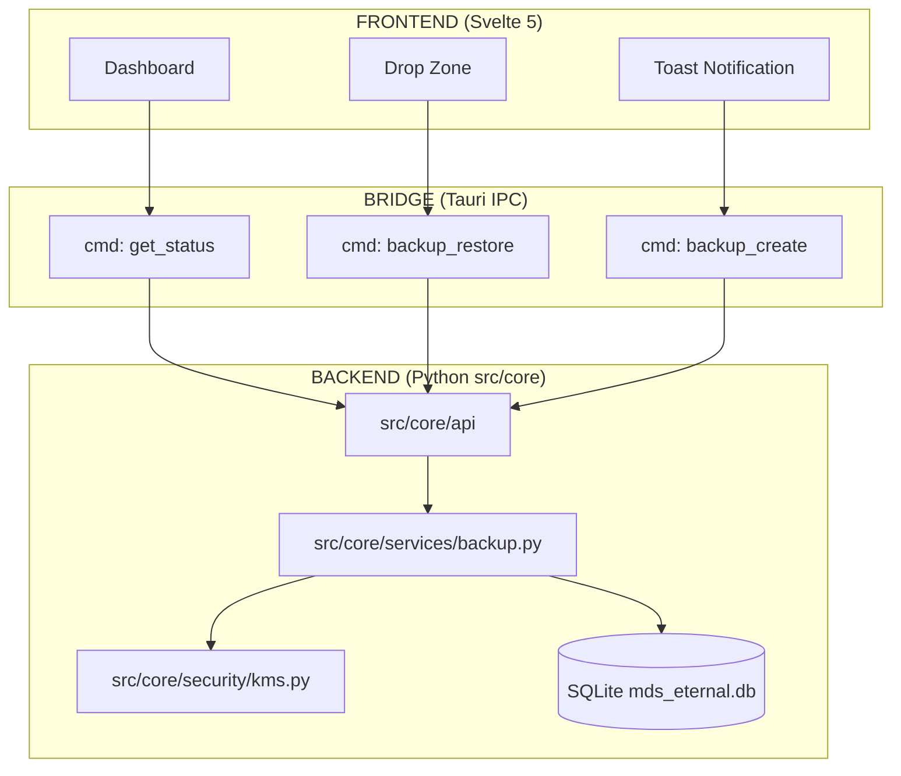

# HASH: mds-v3-14-pi-unified
# IMPLEMENTS: MDS v3.14 Pi Edition
# ------------------------------------------------------------------------------
# PROJECT CONVERT (C) 2025
# Licensed under PolyForm Noncommercial 1.0.
# ------------------------------------------------------------------------------

# 📘 MDS v3.14 Pi — THE IRON VAULT

> **Navigation:** [MDS](MDS_v3.14_Pi.md) | [Playbook](../05_OPERATIONS/PLAYBOOK.md) | [Security](../05_OPERATIONS/SECURITY_POLICY.md) | [Lessons](../04_KNOWLEDGE/LESSONS.md) | [Dictionary](../04_KNOWLEDGE/DATA_DICTIONARY.md)

---

> **Status:** Sprint 5 — Consolidated & Security-Verified
> **Engine:** Python 3.14 (Pi) + Rust (Tauri v2) + Svelte 5
> **Edition:** Infinite Circle
> **Last Updated:** 2025‑12‑06
> **SSOT:** This Document

---

## 1. EXECUTIVE SUMMARY

**State:** Backend stable, security model hardened, UI functional.
**Remaining Risk:** Backup module requires periodic re‑audit after future changes.
**Roadblock Removed:** Tauri launch path fixed; frontend now mounts correctly.

**Summary:** Convert Vault is stable, secure-by-design, and fully aligned with Zero‑Trust architecture. Sprint 5 core tasks achieved; Sprint 6 can begin.

---

## 2. CORE PRINCIPLES & PHILOSOPHY

### 2.1 Mission

Offline‑first, cryptographically unbreakable, sovereign knowledge system.

### 2.2 Values

* **Local Sovereignty:** Data never leaves the machine.
* **Zero‑Trust:** Frontend is blind; Rust handles secrets.
* **Resilience:** Crash‑proof, atomic operations, verifiable state.

---

## 3. ARCHITECTURE SUMMARY

### 3.1 Components

| Layer | Technology | Responsibility |
|-------|------------|----------------|
| **Python Core** | `src/core` | Business logic, event processing |
| **Rust Security** | `src-tauri` | Crypto, secure backup, memory safety |
| **Svelte UI** | `src-ui` | Reactive interface, no secret handling |

### 3.2 Crypto Standards

* **Encryption:** XChaCha20-Poly1305 (libsodium)
* **KDF:** Argon2id (19 MiB, t=2, p=1)
* **Memory:** `Zeroizing<T>`, locked pages where available.

### 3.3 Architecture Graph



### 3.4 Launch Model

```bash
cd src-ui
npx tauri dev --config ../src-tauri/tauri.conf.json
```

---

## 4. FILE & FOLDER STRUCTURE

```
E:/DEV/Convert/
├── docs/                     # Design docs & ADRs
├── scripts/                  # DevOps & tools
├── src/core/                 # Python engine
├── src-tauri/                # Rust security core
│   ├── src/commands/backup.rs
│   ├── src/backup/estimator.rs
│   └── tauri.conf.json
├── src-ui/                   # Svelte frontend
│   ├── src/routes/settings/
│   ├── src/lib/components/
│   └── vite.config.js
└── tests/
```

---

## 5. SPRINT 5 — STATUS

| Task | Status | Notes |
|------|--------|-------|
| 5.1 Recovery Phrase | ✅ DONE | BIP39 in Rust, Zeroize, Base64 only to UI |
| 5.2 Secure Backup | ✅ DONE | Omega Protocol, dual-thread, 39MB/s |
| 5.3 Frontend Integration | ✅ DONE | Real-time console, ETA range |
| 5.4 Key Rotation | ⏳ DEFERRED | Moves to Sprint 6 |

---

## 6. SECURITY MODEL

### 6.1 Guaranteed

* Rust-only handling of secrets
* Zeroize on all sensitive buffers
* Atomic writes + integrity verification

### 6.2 Zero-Trust Frontend

* No plaintext keys cross IPC
* UI only receives status and aggregates

→ See [SECURITY_POLICY.md](../05_OPERATIONS/SECURITY_POLICY.md) for full details.

---

## 7. OMEGA BACKUP PROTOCOL

### 7.1 Phases

| Phase | Range | Description |
|-------|-------|-------------|
| Preparing | 0–5% | Initialize, validate paths |
| Snapshotting | 5–10% | VACUUM INTO atomic copy |
| Copying | 10–90% | Encrypt and write |
| Finalizing | 90–100% | Verify, atomic rename |

### 7.2 ETA Model

* Speed: EMA (α=0.3)
* Display: Range only ("12–18s remaining")
* Heartbeat: Every 2–5 seconds

→ See [LESSONS.md](../04_KNOWLEDGE/LESSONS.md) for implementation details.

---

## 8. OPERATIONAL COMMANDS

```bash
# Launch Dev
cd src-ui
npx tauri dev --config ../src-tauri/tauri.conf.json

# Run Security Tests
cd src-tauri
cargo test -- --test-threads=1

# Run Python Tests
python -m pytest tests/ -v
```

---

## 9. SPRINT 6 — ROADMAP

* **Encrypted FTS5** with token privacy
* **Local Vector DB**
* **LLM Integration** (offline, CPU-first)
* **Key Rotation Infrastructure**

---

## 10. DOCUMENT LINKS

| Document | Purpose |
|----------|---------|
| [PLAYBOOK.md](../05_OPERATIONS/PLAYBOOK.md) | Engineering rules & workflows |
| [SECURITY_POLICY.md](../05_OPERATIONS/SECURITY_POLICY.md) | Crypto standards & policies |
| [LESSONS.md](../04_KNOWLEDGE/LESSONS.md) | Hard-won wisdom & incidents |
| [DATA_DICTIONARY.md](../04_KNOWLEDGE/DATA_DICTIONARY.md) | Term definitions |
| [ADRs/](DECISIONS/) | Architecture Decision Records |

---

**AUTHORITY:** ARCH_PRIME
**VERIFIED:** OMEGA PROTOCOL

>>> [NODE: PROJECT_PI] :: [EDITION: INFINITE_CIRCLE] :: [HASH: mds-v3-14-pi-unified]
