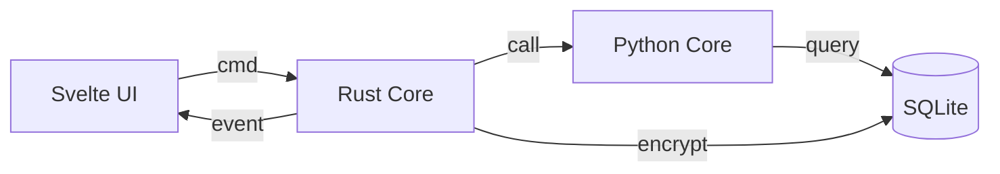

# HASH: mds-v3-14-pi-crystal
# IMPLEMENTS: MDS v3.14 Pi — Crystal Edition
# ------------------------------------------------------------------------------
# PROJECT CONVERT (C) 2025
# Licensed under PolyForm Noncommercial 1.0.
# ------------------------------------------------------------------------------

# 📘 MDS v3.14 Pi — THE IRON VAULT

> **Navigation:** [MDS](MDS_v3.14_Pi.md) | [Playbook](../05_OPERATIONS/PLAYBOOK.md) | [Security](../05_OPERATIONS/SECURITY_POLICY.md) | [Lessons](../04_KNOWLEDGE/LESSONS.md)

---

> **Engine:** Python 3.14 (Pi) + Rust (Tauri v2) + Svelte 5
> **Edition:** Crystal
> **SSOT:** This Document
> **Updated:** 2025-12-07

---

## 1. THE DOCTRINE

**Mission:** Offline-first, cryptographically unbreakable, sovereign knowledge system.

**Metaphor:** The Iron Vault — Rust shell protects Python core protects user data.

**Values:**
- **Local Sovereignty** — Data never leaves the machine
- **Zero-Trust** — Frontend is blind; Rust handles secrets
- **Resilience** — Crash-proof, atomic, verifiable

---

## 2. THE 6 IRON LAWS

| # | Law | Constraint |
|---|-----|------------|
| 1 | **Monorepo** | `src/core` = Python, `src-tauri` = Rust, `src-ui` = Svelte. No exceptions. |
| 2 | **Zero-Trust UI** | Frontend receives only: status, aggregates, `data:image/*`. Never plaintext secrets. |
| 3 | **Zero-Network** | No cloud, no telemetry, no external API. 100% offline. |
| 4 | **Deterministic Build** | Same code → same binary. Pin all dependencies. |
| 5 | **Atomic Operations** | All writes use temp→rename pattern. No partial states. |
| 6 | **Crypto-First** | Security code in Rust only. Zeroize all buffers. No Python crypto. |

→ Violations are architecture bugs, not features.

---

## 3. ARCHITECTURE

### 3.1 Component Boundaries

```
┌─────────────────────────────────────────────────────────┐
│                    SVELTE UI (src-ui)                   │
│                 [BLIND - No Secrets]                    │
└──────────────────────────┬──────────────────────────────┘
                           │ Tauri IPC (events only)
┌──────────────────────────▼──────────────────────────────┐
│                  RUST CORE (src-tauri)                  │
│         [Crypto, Backup, Memory Safety, Zeroize]        │
└──────────────────────────┬──────────────────────────────┘
                           │ PyO3 / Subprocess
┌──────────────────────────▼──────────────────────────────┐
│                 PYTHON CORE (src/core)                  │
│          [Business Logic, Events, Storage]              │
└─────────────────────────────────────────────────────────┘
```

### 3.2 Directory Structure

```
E:/DEV/Convert/
├── docs/                 # This document + ADRs
├── src/core/             # Python: logic, storage, events
├── src-tauri/            # Rust: crypto, backup, security
├── src-ui/               # Svelte: UI only
├── tests/                # All tests
└── scripts/              # DevOps tools
```

### 3.3 Data Flow



---

## 4. PROTOCOLS

### 4.1 Omega Backup Protocol

| Phase | Range | Action |
|-------|-------|--------|
| Prepare | 0-5% | Validate paths, init workers |
| Snapshot | 5-10% | `VACUUM INTO` atomic copy |
| Encrypt | 10-90% | XChaCha20-Poly1305 stream |
| Finalize | 90-100% | Verify hash, atomic rename |

**Constraints:**
- Dual-thread: Worker + Monitor
- ETA: Range only ("12-18s"), never exact
- Heartbeat: Every 2-5 seconds
- Cancel: Safe at any point

### 4.2 Recovery Protocol

| Step | Actor | Action |
|------|-------|--------|
| 1 | Rust | Generate BIP39 mnemonic |
| 2 | Rust | Render to QR in memory |
| 3 | Rust | Encode as `data:image/svg+xml;base64,...` |
| 4 | UI | Display image (never sees words) |

**Constraint:** Mnemonic string NEVER crosses IPC boundary.

### 4.3 Crypto Protocol

| Operation | Algorithm | Parameters |
|-----------|-----------|------------|
| KDF | Argon2id | 19 MiB, t=2, p=1 |
| Encrypt | XChaCha20-Poly1305 | 24-byte nonce |
| Key Wrap | Same | DEK wrapped by KEK |
| Memory | Zeroizing<T> | VirtualLock on Windows |

**Constraint:** All crypto operations in Rust only.

---

## 5. ROADMAP

### Sprint 5 (Current) — Security Foundation

| Task | Status |
|------|--------|
| 5.1 Recovery Phrase | ✅ Done |
| 5.2 Secure Backup | ✅ Done |
| 5.3 Frontend Integration | ✅ Done |
| 5.4 Key Rotation | ⏳ Sprint 6 |

### Sprint 6 (Next) — Cognitive Layer

- Encrypted FTS5 search
- Local Vector DB
- LLM Integration (offline, CPU-first)
- Key Rotation Infrastructure

---

## 6. OPERATIONAL COMMANDS

```bash
# Dev Server
cd src-ui && npx tauri dev --config ../src-tauri/tauri.conf.json

# Rust Tests
cd src-tauri && cargo test -- --test-threads=1

# Python Tests
python -m pytest tests/ -v
```

---

## 7. DOCUMENT LINKS

| Doc | Purpose |
|-----|---------|
| [PLAYBOOK](../05_OPERATIONS/PLAYBOOK.md) | Engineering rules |
| [SECURITY](../05_OPERATIONS/SECURITY_POLICY.md) | Crypto standards |
| [LESSONS](../04_KNOWLEDGE/LESSONS.md) | Incident history |
| [ADRs](DECISIONS/) | Decision records |

---

**AUTHORITY:** ARCH_PRIME
**HASH:** mds-v3-14-pi-crystal
