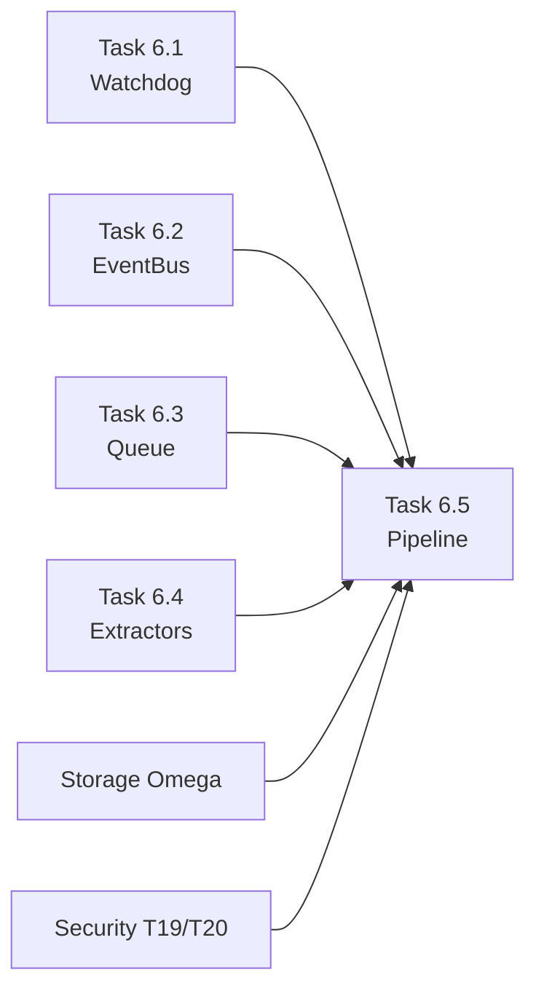

# Documentation Cross-Reference Map

**Purpose:** Quick navigation guide for Task 6.5 Integration Pipeline documentation  
**Last Updated:** 2025-12-28 00:09  
**Status:** FROZEN FOR IMPLEMENTATION

---

## 📚 Core Documentation Files

### Architecture & Strategy

| Document | Purpose | Key Sections |
|----------|---------|--------------|
| [MDS_v3.14_Pi.md](file:///e:/DEV/app-desktop-Convert/docs/01_ARCHITECTURE/MDS_v3.14_Pi.md) | Master technical strategy | Layer 2 (Python Brain), Phase 4 tracking |
| [ARCHITECTURE_DECISIONS.md](file:///e:/DEV/app-desktop-Convert/docs/01_ARCHITECTURE/ARCHITECTURE_DECISIONS.md) | ADR registry | Security protocols, data flow patterns |

### Task 6 Specifications (Sprint 6)

| Task | SPEC File | Status | Key Deliverables |
|------|-----------|--------|------------------|
| **6.1** | [SPEC_TASK_6_1_EVENT_CONTRACT.md](file:///e:/DEV/app-desktop-Convert/docs/03_SPECS/SPEC_TASK_6_1_EVENT_CONTRACT.md) | ✅ DONE | Event schema, batch tracking |
| **6.2** | [SPEC_TASK_6_2_EVENTBUS.md](file:///e:/DEV/app-desktop-Convert/docs/03_SPECS/SPEC_TASK_6_2_EVENTBUS.md) | ✅ DONE | Pub/sub, 260K/sec throughput |
| **6.3** | [SPEC_TASK_6_3_INDEXER_QUEUE.md](file:///e:/DEV/app-desktop-Convert/docs/03_SPECS/SPEC_TASK_6_3_INDEXER_QUEUE.md) | ✅ DONE | SQLite queue, LRU cache |
| **6.4** | [SPEC_TASK_6_4_EXTRACTION.md](file:///e:/DEV/app-desktop-Convert/docs/03_SPECS/SPEC_TASK_6_4_EXTRACTION.md) | ✅ DONE | PDF/DOCX extractors |
| **6.5** | [SPEC_TASK_6_5_INTEGRATION.md](file:///e:/DEV/app-desktop-Convert/docs/03_SPECS/SPEC_TASK_6_5_INTEGRATION.md) | 🚧 READY | **Pipeline orchestration** |

---

## 🔗 Task 6.5 Integration Points

### Dependencies (Upstream)



### Component Mapping

| Task 6.5 Component | Links To | Interface Contract |
|-------------------|----------|-------------------|
| `pipeline.py` | Task 6.4 Extractors | `BaseExtractor.extract()` → `ExtractionResult` |
| `idempotency.py` | Task 6.3 Queue | `hash(path + mtime + size)` → dedup key |
| `registry.py` | Task 6.4 Extractors | MIME → Extractor class mapping |
| `process_file()` | Task 6.1 Watchdog | File event → `PipelineStatus` enum |
| `EncryptedIndexerDB` | Storage Omega | FTS5 write via SQLCipher |
| `PathGuard` | Security T19 | Path validation before processing |

---

## 📋 Implementation Checklist (from SPEC)

### Code Files to Create

- [ ] `src/core/indexer/utils/__init__.py`
- [ ] `src/core/indexer/utils/idempotency.py` - `PipelineStatus`, `EventIdempotency`, `ProcessingRegistry`
- [ ] `src/core/indexer/utils/registry.py` - `ExtractorRegistry`
- [ ] `src/core/indexer/pipeline.py` - `ExtractionPipeline.process_file()`

### Test Files to Create

- [ ] `tests/integration/test_pipeline_integration.py` - T30.01 through T30.04

### Verification Commands

```bash
# New integration tests
pytest tests/integration/test_pipeline_integration.py -v

# Regression tests (must still pass)
pytest tests/indexer/ -v
pytest tests/services/test_watchdog.py -v
```

---

## 🎯 Success Criteria (T30 Test Suite)

| Test ID | Scenario | Expected Result | Evidence |
|---------|----------|----------------|----------|
| **T30.01** | PDF drop → FTS5 search | `INDEXED`, content searchable | Full-text query returns results |
| **T30.02** | DOCX drop → FTS5 search | `INDEXED`, content searchable | Full-text query returns results |
| **T30.03** | Corrupt PDF | `QUARANTINED` | Status logged, no crash |
| **T30.04** | Duplicate event | Second call skipped | Idempotency key match |

---

## 📖 Quick Reference: Where to Find What

| If you need to... | Open this file | Look for... |
|-------------------|----------------|-------------|
| **Understand overall strategy** | `MDS_v3.14_Pi.md` | Layer 2 (The Brain), Contract #2 |
| **See extraction data contract** | `SPEC_TASK_6_4_EXTRACTION.md` | `ExtractionResult` dataclass |
| **Check database schema** | `docs/03_SPECS/storage_omega.md` | FTS5 table definitions |
| **Review security protocols** | `docs/01_ARCHITECTURE/ARCHITECTURE_DECISIONS.md` | ADR-006, PathGuard spec |
| **Implement pipeline logic** | `SPEC_TASK_6_5_INTEGRATION.md` | Component breakdown, 7-step flow |
| **Write integration tests** | `SPEC_TASK_6_5_INTEGRATION.md` | Section 3: Verification Plan |

---

## 🚀 Implementation Timeline

| Time | Milestone | Deliverable |
|------|-----------|-------------|
| **T+00:00** | SPEC Freeze | This document + SPEC_TASK_6_5 |
| **T+00:20** | Core Utils | `idempotency.py`, `registry.py` |
| **T+00:40** | Pipeline | `pipeline.py` with 7-step flow |
| **T+01:00** | Integration Tests | T30.01-T30.04 GREEN |
| **T+01:20** | Regression Check | All existing tests still pass |
| **T+01:30** | Documentation | Update walkthrough.md |

---

## ⚠️ Architectural Invariants (DO NOT VIOLATE)

1. **No extractor knows about SQLCipher** - Extractors return `ExtractionResult`, pipeline handles storage
2. **No pipeline logic inside extractor** - Extractors are pure functions
3. **No retry logic inside registry** - Registry only routes, pipeline handles errors
4. **PipelineStatus is the only contract upward** - Never raise exceptions to caller
5. **Idempotency is best-effort** - TTL expiry is acceptable, watchdog will resend

---

**Approved by:** Chief Architect  
**Frozen for Implementation:** 2025-12-28 00:08  
**Next Action:** Begin coding `idempotency.py`
